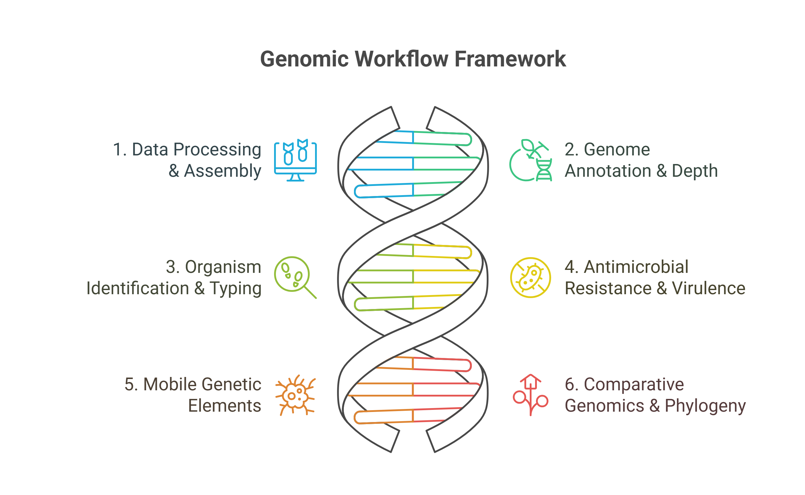

# 🧬 Bacterial Whole Genome Analysis Guideline for Beginners

Welcome to the **Bacterial Whole Genome Analysis Guideline for Beginners**! This repository serves as a comprehensive starting point for researchers interested in bacterial genome analysis, focusing on tools and techniques for comparative genomics and metagenomics.

## 📚 Overview
This guideline is designed for dry lab (computational) analysis of bacterial genomes. It covers:

- **🔬 Comparative Genomics:** Analyze and compare multiple bacterial genomes.  
- **🧩 Functional Annotation:** Identify genes, AMR genes, plasmids, virulence factors, and mobile elements.  
- **📊 Visualization:** Generate phylogenetic trees, heatmaps, and pangenome plots.  
- **🎓 Beginner-Friendly:** Step-by-step instructions for easy understanding.

  

## 🎯 Features
- **Comparative Genomics:** Step-by-step instructions for analyzing and comparing bacterial genomes.
- **Beginner-Friendly:** Simplified explanations and practical tips to get you started.

---

## 📖 Table of Contents
1. [🏃Getting Started](#getting-started)
2. [📜Prerequisites](#prerequisites)
3. [🛠️Setup and Installation](#setup-and-installation)
4. [⚙️Workflow](#workflow)
5. [💡Contributing](#contributing)

---

## 🏃Getting Started
1. Review the workflows to understand the steps.  
2. Install each tool as instructed in its corresponding `.md` file.  
3. No special environment required, but Linux familiarity is helpful.

## 📜Prerequisites
Before diving in, ensure you have the following:
- **Basic Knowledge**: Familiarity with Linux and command-line tools.
- **Software Requirements**:
  - Tools already referenced in this repository.
  - [🛠️Setup and Installation](#setup-and-installation) section for details.
  - Can manually install all the tools (instructinos are in all .md files)

## 🛠️Setup and Installation
To replicate the workflows described:
1. Just go through the folders afer checking the workflow and just install manually; all the installation process are in the .md files

## ⚙️Workflow
The following workflows are included in this repository:

### 1. Data Processing & Assembly
- [FASTQ Processing](FASTQ_to_FASTA/FASTQ_processing.md)  
- [Genome Assembly](FASTQ_to_FASTA/Genome_Assembly.md)  
- [Quality Assessment](FASTQ_to_FASTA/Quality_Assessment.md)  
- [SeqKit Utilities](FASTQ_to_FASTA/SeqKit.md)  

### 2. Genome Annotation & Depth
- [Genome Annotation](Annotations/Genome_Annotaions.md)  
- [Genome Depth Analysis](Annotations/Genome_depth.md)  

### 3. Organism Identification & Typing
- [Organism Identification](Identification/Organism_Identification.md)  
- [Multi-Locus Sequence Typing (MLST)](Identification/Multi_Locus_Sequence_Type.md)  
- [Average Nucleotide Identity (ANI)](Identification/Average_nucleotide_identity.md)  
- [Average Amino Acid Identity (AAI)](Identification/Average_Amino_Acid_Identity.md)  
- [OrthoANI Analysis](Identification/OrthoANI.md)  
- [16S rRNA Analysis](Identification/16s_rRNA.md)  

### 4. Antimicrobial Resistance & Virulence
- [AMR Genes & Profiling](AMR_Virulence/AMR_genes_and_profiling.md)  
- [Virulence Factors](AMR_Virulence/Virulence_factors.md)  

### 5. Mobile Genetic Elements
- [Plasmid Analysis](Mobile_genetic_elements/Plasmid.md)  
- [Other MGEs](Mobile_genetic_elements/MGE.md)  

### 6. Comparative Genomics & Phylogeny
- [Phylogeny & Pangenome Analysis (Roary)](Pangenome_Phylogenetics/Phylogeny_Tree_and_Pangenome_Analysis_by_ROARY.md)  
- [Phylogenetic Tree using MEGA11](Pangenome_Phylogenetics/Phylogeny_Tree_Mega11.md)  
- [Phylogenetic Tree using KBase](Pangenome_Phylogenetics/Phylogeny_Tree_Kbase.md)  

### Others
- [SeqKit.md](FASTQ_to_FASTA/SeqKit.md).

## 💡Contributing
Contributions are welcome! You can:

- Suggest improvements  
- Add new workflows or tutorials  
- Report issues or bugs  

## 📩 Contact
For queries or collaboration, please contact [galeeb115@gmail.com].